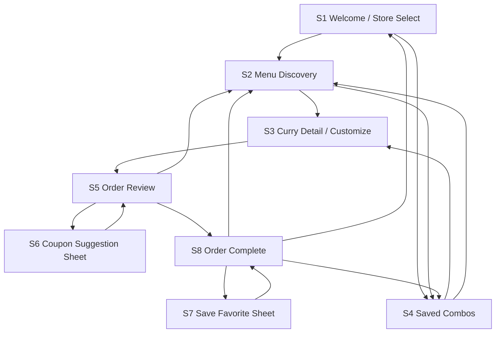

# CoCo壱番屋 新規アプリ PoC 画面遷移図

- 作成日: 2026-03-28
- 目的: PoCで実装する注文体験の画面遷移を定義する
- 関連資料:
  - `docs/poc-app-direction-2026-03-28.md`
  - `docs/app-renewal-planning-611124786-jp-2026-03-28.md`

## 画面遷移の考え方

このPoCでは、`最短で注文を完了する主導線` を最優先に置きます。
その上で、注文体験を豊かにする `お気に入り保存` `クーポン提案` `完了後の再利用導線` をサブ導線として追加します。

アプリ全体には `Home` を起点にしたタブシェルを持てるが、本ドキュメントでは `注文を始めてから完了するまでの主導線` を定義する。
そのため `S1` は `アプリ起動直後の唯一の初期画面` ではなく、`注文開始時または受取条件変更時に入るゲート` として扱ってよい。

遷移の基本方針は次の通りです。

- 画面の主遷移は `NavigationStack` を前提とした push 中心
- 補助操作は `sheet` または `bottom sheet` で見せる
- ベースのカレー選択後は、基本設定を一画面で決めてからトッピングへ進む 2段階でカスタマイズを進める
- 完了後は戻るのではなく、明確な完了画面を経由する
- ログイン前提の分岐は持たない

補足:

- ログイン / 会員体験は重要な将来検討項目だが、初版 PoC では `注文主導線を止めないこと` を優先する
- 認証導線を将来入れる場合は、`Rewards`、保存同期、注文完了後の再訪文脈など、主導線の外側から検証する
- 将来の本実装では、`注文開始時にログインを促す` 案を検討してよい。ただし `アプリ起動時の強制ログイン` は避け、一度ログインした後は継続ログイン前提とする

## 画面一覧

| ID | 画面名 | 役割 |
| --- | --- | --- |
| S1 | Welcome / Store Select | 注文開始または受取条件変更の起点。店舗を決める |
| S2 | Menu Discovery | 商品を探し、選ぶ |
| S3 | Curry Detail / Customize | カレー詳細とカスタマイズ |
| S4 | Saved Combos | 保存済みのお気に入り構成を選ぶ |
| S5 | Order Review | カート内容の確認と注文確定、追加注文判断 |
| S6 | Coupon Suggestion Sheet | 適用可能クーポンの提案 |
| S7 | Save Favorite Sheet | 完了した注文をお気に入り名付きで保存 |
| S8 | Order Complete | 注文完了演出と次行動提示 |

## 全体遷移図



## 主導線

### 1. 最短注文フロー

最も重要な導線です。

```text
S1 Store Select
  -> S2 Menu Discovery
  -> S3 Curry Detail / Customize
  -> S5 Order Review
  -> S6 Coupon Suggestion Sheet
  -> S8 Order Complete
```

狙い:

- 店舗決定後、余計な登録導線なしで注文検討に入れる
- 商品選択から確認までを一筆書きで進める
- クーポンは最後に提案し、文脈に合うものだけを見せる
- 完了時に不安を残さない

補足:

- `S3 -> S5` 到達時点では現在の注文は `pending draft` として保持し、まだ cart line item へ昇格させない
- `続けて注文` を押した時に `pending draft` を cart line item に昇格させ、`S5 -> S2 -> S3 -> S5` のループで 2皿目やサイド追加へ戻れるようにする
- `注文を確定` では `cartItems + pending draft` をまとめて確定対象に含める
- PoC 初版では `pending draft` は常に 1 件だけ保持する
- `S5 -> S3` の `内容を修正` では `pending draft` を保持したまま編集に戻る
- `S3 -> S2` で戻った時も `pending draft` は保持するが、別メニューを選んだ時点で新しい選択に置き換える
- 店舗変更では `cartItems / pending draft / applied coupon` を全て破棄して `S1` に戻る
- 注文完了では `cartItems + pending draft` を `CompletedOrder` へ確定し、その後に active order state を初期化する

### 2. お気に入り経由フロー

常連利用に向けた時短導線です。

```text
S1 Store Select
  -> S4 Saved Combos
  -> S3 Curry Detail / Customize
  -> S5 Order Review
  -> S6 Coupon Suggestion Sheet
  -> S8 Order Complete
```

狙い:

- いつもの注文をベースに小さく調整する
- Saved Combos を独立画面にしつつ、注文主導線から浮かせない

## 注文手順の整理

PoC では、公式の注文手順をそのまま複製するのではなく、`ネイティブらしく迷わず進める順番` として再構成する。
各 phase で見せる具体要素は後続で詰めるが、進行順は以下を基準にする。

1. `S2 Menu Discovery` でベースのカレーメニューを選ぶ
2. `S3 Curry Detail / Customize` の `基本設定 phase` で `カレーソース` `ライス量` `辛さ` を一画面で選ぶ
3. `S3 Curry Detail / Customize` の `基本設定 phase` で `ソース量` を必要時だけ折りたたみで調整する
4. `S3 Curry Detail / Customize` の `トッピング phase` で `追加トッピング` を選ぶ
5. `S5 Order Review` で `2皿目のカレー / サイドメニューを追加する` か `注文確定へ進む` かを決める

UI方針:

- `S3` では `基本設定 -> トッピング` の 2 phase が常に分かる進捗表示を見せる
- 基本設定 phase では `今どの調整をしているか` よりも `何が一画面で決められるか` を優先して見せる
- `ソース量` は主導線を邪魔しない補助調整として折りたたみ表示にする
- phase ごとの具体UIは後続で詰めるが、進行順そのものは固定する

## 画面ごとの遷移定義

### S1. Welcome / Store Select

目的:

- 注文開始の心理的ハードルを下げる
- 店舗が決まったらすぐ食事検討に移す

遷移:

- `店舗を選択` -> `S2 Menu Discovery`
- `保存済みから始める` -> `S4 Saved Combos`

UIメモ:

- 店舗選択は `注文開始時` または `店舗変更時` に開くゲート画面として扱う
- アプリ全体の初期表示を Home タブにしてもよい
- 店舗確定時に軽い成功演出を返す

### S2. Menu Discovery

目的:

- メニュー一覧から迷わず商品を選ばせる
- 探す行為自体を楽しくする
- 注文手順の最初の 1 ステップとして、ベースのカレーを選ばせる

遷移:

- `商品カードを選択` -> `S3 Curry Detail / Customize`
- `保存済み構成を見る` -> `S4 Saved Combos`
- `店舗変更` -> `S1 Welcome / Store Select`

UIメモ:

- おすすめ、定番、最近見た構成などの区切りを試す
- 検索や絞り込みはネイティブの検索UIを使う
- 商品カード選択後は、S3 の基本設定 phase へ自然につなげる

### S3. Curry Detail / Customize

目的:

- PoCの中心画面
- カスタマイズの楽しさと分かりやすさを両立する
- 公式の注文手順に近い順で、1段ずつ迷わず進める

遷移:

- `Review Order` -> `S5 Order Review`
- `戻る` -> `S2 Menu Discovery` または `S4 Saved Combos`

UIメモ:

- `基本設定 -> トッピング` の 2 phase で進める
- 基本設定 phase では `カレーソース` `ライス量` `辛さ` を一画面で決められるようにする
- `ソース量` は折りたたみ表示で持ち、必要な人だけが開いて微調整できるようにする
- phase 表示で現在地と残り工程を見せる
- トッピング、辛さ、量、ソース系の変更は即時反映
- 価格とビジュアルの変化を遅延なく見せる
- `S3` は draft を作り込む画面、`S5` は pending draft を受けて review / 追加注文 / 注文確定を判断する画面として責務を分ける
- 保存導線は完了後に寄せ、`S3` では作り込むことに集中させる

### S4. Saved Combos

目的:

- 保存した構成の再利用を速くする
- 再注文文化を作る

遷移:

- `保存済み構成を選択` -> `S3 Curry Detail / Customize`
- `メニュー一覧へ` -> `S2 Menu Discovery`
- `店舗変更` -> `S1 Welcome / Store Select`

UIメモ:

- 完全固定ではなく、再開後に編集できる前提
- `いつものやつ` を一番気持ちよく始められる画面にする

### S5. Order Review

目的:

- 注文の不安をなくし、最後の確認を短く済ませる
- 1皿目投入後に、追加注文へ戻るかそのまま確定するかを迷わせない

遷移:

- `続けて注文` -> `S2 Menu Discovery`
- `クーポンを見る` -> `S6 Coupon Suggestion Sheet`
- `注文を確定` -> `S8 Order Complete`
- `内容を修正` -> `S3 Curry Detail / Customize`

UIメモ:

- 合計、内容、受取店舗が一画面で確認できる
- 初回到達時は `pending draft` のみを見せ、まだ追加注文へ戻れる 1皿として扱う
- `内容を修正` で S3 に戻す対象は `pending draft` のみとし、既に cart line item 化した皿は初版 PoC では個別編集対象に含めない
- `続けて注文` を押した時にだけ `pending draft` を cart line item に昇格させる
- `注文を確定` では残っている `pending draft` も cart と一緒に確定対象へ含める
- 1皿目追加後に `2皿目のカレー` または `サイドメニュー` へ戻る導線を持つ
- クーポンは独立画面へ飛ばさず sheet で補助表示する
- お気に入り保存はここでは出さず、完了後の `S8` で提案する
- フッターは `合計金額` の上に `続けて注文` と `注文を確定` を並べ、`注文を確定` を強い主要CTAとして固定配置する

### S6. Coupon Suggestion Sheet

目的:

- `使えるか分からない` 状態をなくす
- 最後に自然に得を提示する

遷移:

- `クーポンを適用` -> `S5 Order Review`
- `適用せず閉じる` -> `S5 Order Review`

UIメモ:

- bottom sheet 想定
- 適用可能な候補だけを上位に出す
- 説明よりも `この注文ならこれが使える` を優先する

### S7. Save Favorite Sheet

目的:

- 完了した注文を、次回再利用しやすい名前で保存する

遷移:

- `保存する` -> 呼び出し元へ戻る
- `キャンセル` -> 呼び出し元へ戻る

呼び出し元:

- `S8 Order Complete`

UIメモ:

- modal sheet 想定
- 直前の注文内容が分かる状態で、名前編集を最短で終えられるようにする

### S8. Order Complete

目的:

- 注文成功を曖昧にしない
- 次の行動を明確にする

遷移:

- `お気に入りとして保存` -> `S7 Save Favorite Sheet`
- `もう一度メニューを見る` -> `S2 Menu Discovery`
- `保存済みを見る` -> `S4 Saved Combos`
- `店舗選択に戻る` -> `S1 Welcome / Store Select`

UIメモ:

- 注文確定、受取店舗、受取目安を明示する
- 成功演出は出すが、長すぎない
- 保存提案は成功確認の後に短く置き、主CTAを奪わない
- 触覚フィードバックを組み合わせる

## 状態変化とモーダル方針

### Pushで遷移する画面

- S1 Welcome / Store Select
- S2 Menu Discovery
- S3 Curry Detail / Customize
- S4 Saved Combos
- S5 Order Review
- S8 Order Complete

理由:

- 注文の進行感と現在地を明確にするため

### Sheetで開く画面

- S6 Coupon Suggestion Sheet
- S7 Save Favorite Sheet

理由:

- 主導線を切らず、補助判断として扱いたいため

## 遷移上の重要ルール

1. ログイン要求で主導線を止めない
2. WebViewへは遷移しない
3. クーポンは専用タブに逃がさず、確認画面の文脈で提案する
4. 完了画面を必ず通す
5. 保存済み構成は一覧閲覧だけで終わらせず、注文再開へ直結させる

補足:

- 将来ログイン導線を追加する場合も、上記 1 を壊さないことを優先する

## 実装優先度

### P0

- S1 Welcome / Store Select
- S2 Menu Discovery
- S3 Curry Detail / Customize
- S5 Order Review
- S6 Coupon Suggestion Sheet
- S8 Order Complete

### P1

- S4 Saved Combos
- S7 Save Favorite Sheet

PoCとして最初に成立させるべきなのは、`最短注文フローが気持ちよく完走できること` です。
完了後のお気に入り保存は重要ですが、主導線が成立してから載せてもよいです。

## 次に詰める論点

1. S2 Menu Discovery の情報構造をどう切るか
2. S3 Curry Detail / Customize の基本設定 phase で、価格と現在構成をどこまで固定表示にするか
3. S5 Order Review でクーポン提案を自動表示にするか、CTA表示にするか
4. S8 Order Complete の成功演出をどの程度強くするか
5. Saved Combos をタブにしない場合、どこから最も自然に再訪できるか
